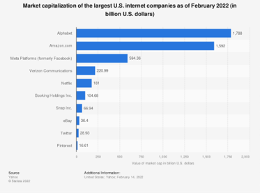

##

##How COVID-19 Influences Job Interview Behaviors

#### Group: Goodfellas
#### Group members: Sophie Wang, Zhe Zhang, Baotoang Zhang, Guangyuan Chen

### Project Schedule
#### 1) set up our main goal to explore social science influence by Covid-19
#### 2) aim at Glassdoor website and make plans to dig out interesting information about changes of American job market
#### 3) code design for data scraping (first main part of this video)
#### 4) code design for data processing and analyzing (second main part of this video)
#### 5) conclude results and make the presentation

### Data Sources
#### Glassdoor
Glassdoor is an American website where current and former employees anonymously review companies.
Glassdoor also allows users to anonymously submit and view salaries as well as search and apply for jobs on its 
platform. (Wikipedia)

#### Statista
Statista is a German company specializing in market and consumer data. According to the company, 
its platform contains more than 1,000,000 statistics on more than 80,000 topics from more than 22,500 sources and 170 different industries, and generates a revenue of about €60 million.

### Data Samples
- Data entry: each targeted post on Glassdoor 
- From 2009/3/11 to 2020/2/1: 43k
- From 2020/2/1 to 2022/2/23: 22k

### Data Visualization

### Findings

1. Frequency of "phone” has been very high, no matter before or after the COVID-19.

2. “Onsite”/ “No Onsite” ? 
   - “Video interview” It is being used as an effective interview tool by the company
  
3. “Team” & “leadership” 
   - Cooperation among colleagues is becoming more and more important,and leadership is an important 	criterion for companies to measure

